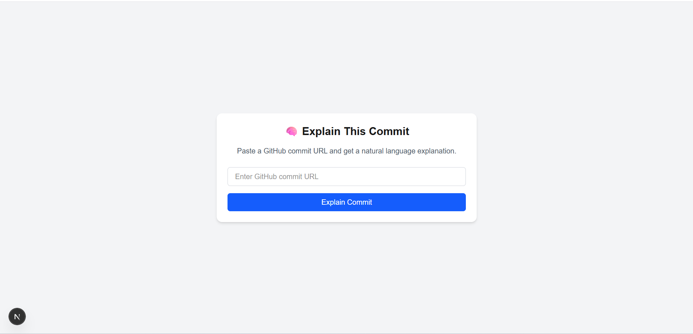

## 🧠 Explain This Commit

A developer tool that explains GitHub commits in plain English using the power of OpenAI's GPT models.

> Paste a GitHub commit URL → get an instant explanation.



---

### 📦 Tech Stack

* **Frontend**: Next.js 15 (App Router)
* **Backend**: Fastify (TypeScript)
* **AI**: OpenAI GPT API

---

### 🚀 Getting Started

#### 1. Clone & Install

```bash
git clone https://github.com/yourusername/commit-explainer.git
cd commit-explainer
pnpm install
```

#### 2. Set Up Environment

Create an `.env` file inside `apps/api/`:

```env
# apps/api/.env
OPENAI_API_KEY=your_openai_api_key_here
GITHUB_TOKEN=your_github_token
```

You can get your OpenAI API key from: [https://platform.openai.com/account/api-keys](https://platform.openai.com/account/api-keys)

#### 3. Run Locally

In one terminal:

```bash
pnpm --filter api dev
# Fastify server on http://localhost:3001
```

In another terminal:

```bash
pnpm --filter web dev
# Next.js app on http://localhost:3000
```

---

### 🧪 How It Works

1. Paste a GitHub commit URL (e.g., `https://github.com/user/repo/commit/abcd123`)
2. Frontend sends a `POST` request to `/explain`
3. Backend uses GitHub API to fetch the commit diff
4. GPT generates a plain-English explanation
5. Result shown in the UI

---

### 📁 Project Structure

```
commit-explainer/
├── apps/
│   ├── api/         # Fastify backend
│   └── web/         # Next.js frontend
├── packages/
│   └── utils/       # GPT + GitHub clients
├── .gitignore
├── pnpm-workspace.yaml
└── README.md
```

---

### 🧩 TODOs

* [ ] Input validation (URL format)
* [ ] Error handling (invalid commit / no diff)
* [ ] Caching results
* [ ] Deploy (Vercel + Render)

---

### 📜 License

MIT © 2025 Piyush Soni
